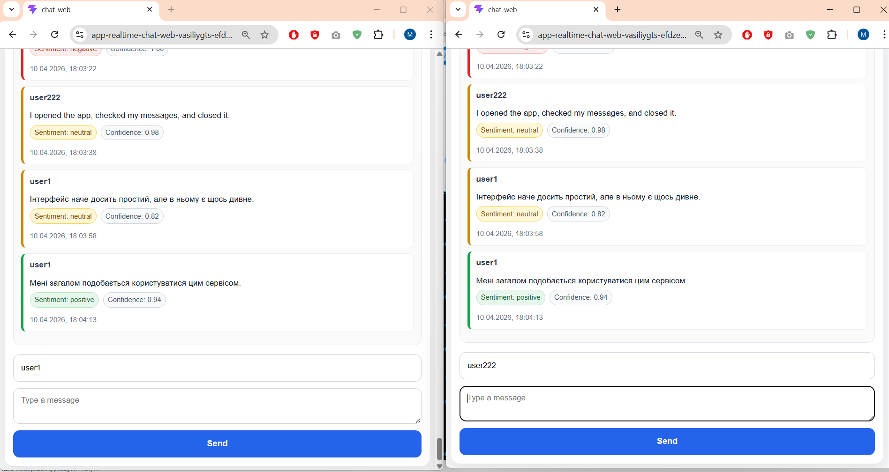
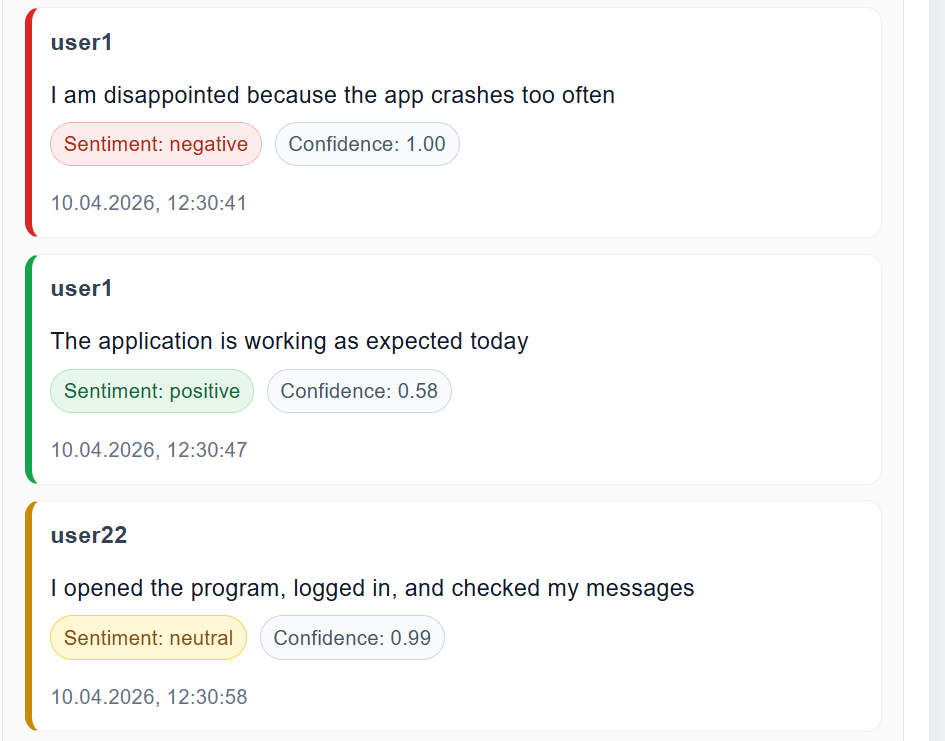
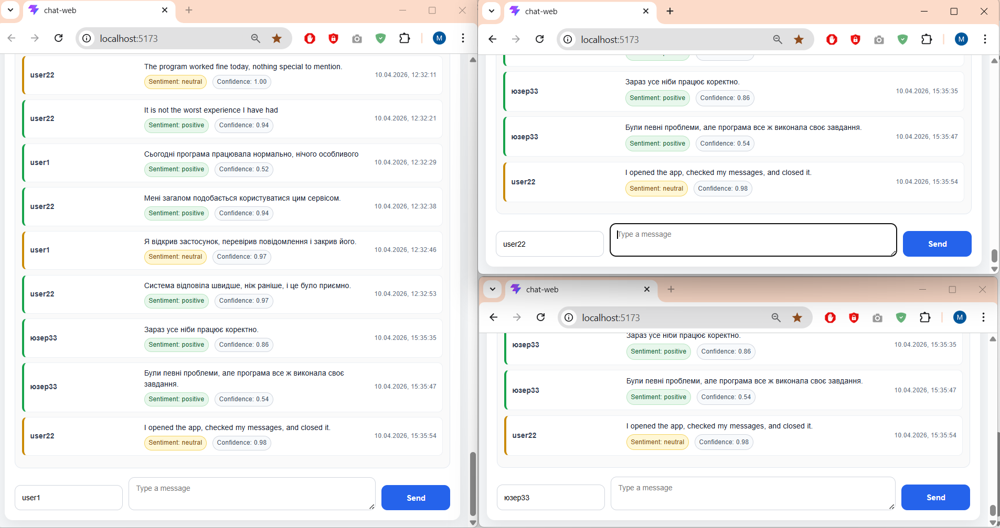

# Realtime Chat Application with Azure

Realtime chat application built with **ASP.NET Core**, **React + Vite**, **Azure SignalR Service**, **Azure SQL Database**, and **Azure AI Language** for sentiment analysis.

The application supports real-time messaging between multiple clients, stores message history in Azure SQL, and analyzes each message sentiment with confidence score visualization in the UI.

## Features

- Real-time chat with multiple connected clients
- Message history loading from database
- Message persistence in Azure SQL Database
- Sentiment analysis for each message using Azure AI Language
- Sentiment confidence score display
- Color highlighting for positive / neutral / negative messages
- Enter to send message
- Shift + Enter for multiline message
- Auto-scroll to the latest message
- Azure deployment for both backend and frontend

## Demo

### Azure Frontend
https://app-realtime-chat-web-vasiliygts-efdzefbwd0hmczbd.polandcentral-01.azurewebsites.net/

### Azure Backend API
https://app-realtime-chat-api-vasiliygts-ehhyhcfgh4buejda.polandcentral-01.azurewebsites.net/api/messages

## Screenshots

### Chat running in two browser tabs


### Sentiment analysis in messages


### Multiple local chat windows


## Tech Stack

### Backend
- ASP.NET Core 8
- Entity Framework Core
- Azure SQL Database
- Azure SignalR Service
- Azure AI Language / Text Analytics
- Swagger

### Frontend
- React
- Vite
- TypeScript
- CSS

### Cloud / DevOps
- Azure App Service
- GitHub Actions

## How it works

1. A user sends a message from the React frontend.
2. The ASP.NET Core backend receives the message.
3. The backend sends the message text to Azure AI Language for sentiment analysis.
4. The message is saved to Azure SQL Database together with:
   - `sentiment`
   - `sentimentScore`
5. The backend broadcasts the new message through Azure SignalR.
6. All connected clients receive the new message in real time.

## Sentiment Visualization

Each message includes:
- **Sentiment**: positive / neutral / negative
- **Confidence**: numeric sentiment score

UI highlighting:
- Positive → green
- Neutral → yellow
- Negative → red

## Project Structure

```text
Realtime-chat-azure/
│
├── Chat.Api/                 # ASP.NET Core backend
├── Chat.Web/                 # React + Vite frontend
├── .github/
│   └── workflows/            # GitHub Actions workflows
├── Screenshot_1.png
├── Screenshot_2.png
├── Screenshot_3_local.png
└── README.md
```

## Local Run

### Backend

```bash
cd Chat.Api
dotnet restore
dotnet run
```

Backend runs locally on:

`https://localhost:7096`

### Frontend

```bash
cd Chat.Web
npm install
npm run dev
```

Frontend runs locally on:

`http://localhost:5173`

## Environment Files

### Development

File: `Chat.Web/.env.development`

```env
VITE_API_BASE_URL=https://localhost:7096
```

### Production

File: `Chat.Web/.env.production`

```env
VITE_API_BASE_URL=https://app-realtime-chat-api-vasiliygts-ehhyhcfgh4buejda.polandcentral-01.azurewebsites.net
```

## Backend Configuration

The backend Azure App Service uses these application settings:

- `ConnectionStrings__DefaultConnection`
- `Azure__SignalR__ConnectionString`
- `Azure__Language__Endpoint`
- `Azure__Language__ApiKey`
- `ASPNETCORE_ENVIRONMENT=Production`

> Secrets are stored in Azure App Service configuration and are not included in the repository.

## Azure Resources

Resource group:
- `rg-realtime-chat-dev`

Main Azure resources:
- Backend Web App: `app-realtime-chat-api-vasiliygts`
- Frontend Web App: `app-realtime-chat-web-vasiliygts`
- SignalR: `sig-realtime-chat-dev`
- Language resource: `lang-realtime-chat-dev`
- SQL Server: `sqlrtchatvasiliygts`
- Database: `free-sql-db-2914747`

## Deployment

### Backend
Backend is deployed with GitHub Actions workflow for `Chat.Api`.

### Frontend
Frontend is deployed with GitHub Actions workflow for `Chat.Web`.

Both workflows are configured for the `dev` branch and are scoped to project-specific paths.

## API

### Get all messages

```http
GET /api/messages
```

Returns chat history including:

- `id`
- `userName`
- `text`
- `createdAtUtc`
- `sentiment`
- `sentimentScore`

## Notes

- Swagger is enabled only in Development environment
- Production frontend uses Azure backend URL through `VITE_API_BASE_URL`
- Message duplication issue in frontend was resolved during development
- Real-time communication works across multiple browser tabs and windows

## Author

Developed as a test project for an Azure-based real-time chat with sentiment analysis.
